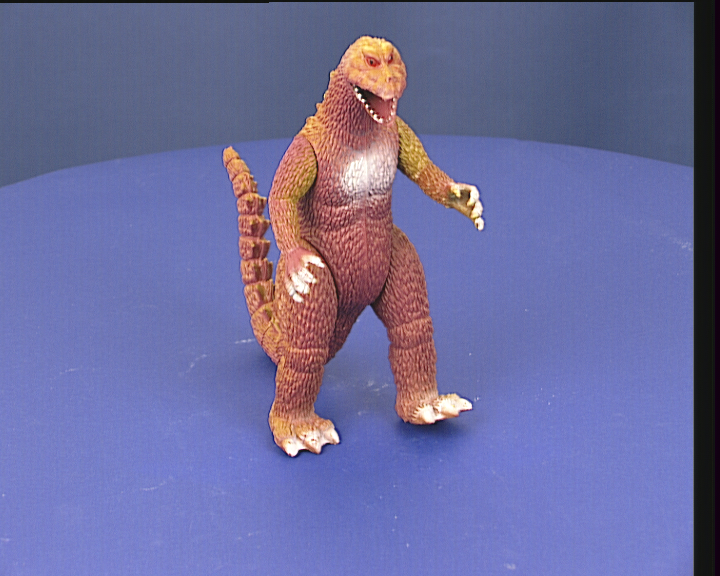

# :wrench: Voxel Carving for 3D Reconstruction of Images 🦖

In this work a technique called *Voxel Carving* is employed in order to reconstruct a 3D digital version of a toy dinosaur from a series of two dimensional images of the object itself from different perspectives.

The images of the dinosaur and their respective *Perspective Projection Matrices* have been collected from the website of the *Department of Engineering Science* of the *University of Oxford* at the following link: https://www.robots.ox.ac.uk/~vgg/data/mview/.

Firstly, a binary mask that segments the dinosaur from the background in each image is obtained through a pre-processing step.
Secondly, a voxel grid of 3D points that encloses the dinosaur is created and projected on each image through the use of the Perspective Projection Matrices.
Next, the *occupancy* of each 3D voxel grid points is computed as the number of times that it is projected inside the binary mask of the dinosaur in each image. In other words, the number of times a voxel point can be ``seen" inside the dinosaur shape is computed considering each available perspective.
Finally, just the points that reach a certain occupancy threshold are kept and they are considered as points that define the 3D mesh of the dinosaur toy.

  
  
  
  
  
  
  
  
  
  
  
  
  
  
  
  
  
  
  
  
  
  
  
  
  
  
  
  
  
  
  
  
  
  
  
  
  

For more detailed informations about the used functions, look into the corresponding docstrings inside the python files, inside the `src` folder.

## Usage
Run the notebook in order to apply the voxel carving process. The resulting rectilinear voxel grid along with the occupancies values of each point will be saved in the [`out/shape.vtr`](out/shape.vtr) file.

In order to select an occupancy threshold and save the resulting mesh as a 3D `.PLY` object download the *ParaView* software and follow these steps:
- Open the *ParaView* software.
- Import the [`out/shape.vtr`](out/shape.vtr) file through the `Open` button.
- Add a *IsoVolume* filter from the `Filters` dropdown menu.
- In the `Properties` menu of the *IsoVolume* filter set the minimum *Input Scalars* points to the desired occupancy threshold (for this work it has been set to $32$)
- Add an *ExtractSurface* filter from the `Filters` dropdown menu.
- Add a *PLY* extractor from the `Extractors` dropdown menu.
- Go to the `File` dropdown menu and select `Save Extracts...`.

## Repository structure

    .
    ├── input
    │   ├── images                                              # Directory containing the images of the toy dinosaur.
    │   └── dino_Ps.mat                                         # The perspective Projection Matrices of the images of the toy dnosaur.
    ├── out
    │   ├── images                                              # Directory containing the output images obtained during the process.
    │   ├── shape.pvsm                                          # Saved state of ParaView for visualization.
    │   ├── shape.vtr                                           # Rectilinear grid used for visualization in ParaView.
    │   └── toy-dinosaur.ply                                    # Reconstructed 3D model of the toy dnosaur.
    ├── src
    │   ├── __init__.py                                         # Directory containing the output images obtained during the process.
    │   ├── data_loader.py                                      # Python module providing functions to load the data.
    │   ├── data_saver.py                                       # Python module providing functions to save the data.
    │   ├── processing.py                                       # Python module providing functions to process the images of the toy dinosaur.
    │   ├── seeder.py                                           # Python module providing a functions to set the seed.
    │   ├── visualization.py                                    # Python module providing functions to visualize the results.
    │   └── voxeling.py                                         # Python module providing functions to apply the voxel carving technique.
    ├── config.yaml                                             # File containing configuration parameters.
    ├── Voxel Carving for 3D Reconstruction of Images.ipynb     # Notebook illustrating the workflow pipeline.
    ├── .gitattributes
    ├── .gitignore
    ├── LICENSE
    └── README.md

## Dependencies
### Python
- [IPyWidgets](https://ipywidgets.readthedocs.io/en/stable/)
- [OpenCV](https://pypi.org/project/opencv-python/)
- [Matplotlib](https://matplotlib.org/)
- [NumPy](https://numpy.org/)
- [Scipy](https://scipy.org/)
- [VTK](https://vtk.org/)

### External Software
- [ParaView](https://www.paraview.org/)

## Versioning

Git is used for versioning.

## License

This project is licensed under the MIT License - see the [LICENSE](LICENSE) file for details.
